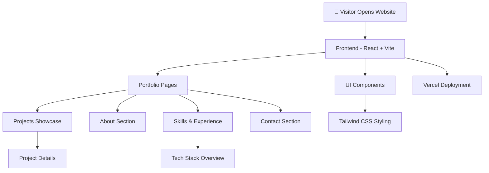

<div align="center">

# 👋 Kishore P — Personal Portfolio

### Final Year CSE (AI & Robotics) @ VIT Chennai | AWS Cloud Practitioner | Alpha MLSA

**A modern developer portfolio showcasing projects, AI research, cloud experience, and frontend development work.**
*Built to highlight skills in AI, Generative AI, LLMs, Cloud, and UI/UX engineering.*

<br>

[](https://react.dev/)
[](https://vitejs.dev/)
[](https://tailwindcss.com/)
[](https://vercel.com/)
[]()

</div>

---

# 🌐 Live Portfolio

🚀 **Explore the portfolio here:**
👉 [https://kishore-p-portfolio.vercel.app/](https://kishore-p-portfolio.vercel.app/)

---

# 📖 What is this Portfolio?

This repository contains the source code for **Kishore P's personal developer portfolio**, built to showcase projects, technical expertise, achievements, and experiences.

The portfolio highlights work across multiple domains including:

* Artificial Intelligence & Machine Learning
* Generative AI & Large Language Models
* Cloud Computing (AWS & Google Cloud)
* Frontend Development
* UI/UX Design

The website acts as a **central hub for projects, achievements, technical blogs, and professional experience**.

---

# 👨‍💻 About Me

I’m **Kishore P**, a **Final Year Computer Science Engineering student (AI & Robotics) at VIT Chennai** with a strong interest in **AI systems, cloud technologies, and interactive frontend applications**.

My areas of focus include:

| Domain                   | Description                                    |
| ------------------------ | ---------------------------------------------- |
| 💻 Frontend Development  | Building responsive, modern web interfaces     |
| 🎨 UI/UX Design          | Designing clean and intuitive user experiences |
| 🧠 Machine Learning & AI | Developing intelligent models and AI systems   |
| 🤖 Generative AI         | Exploring LLMs, RAG systems, and AI agents     |
| ☁️ Cloud Computing       | Deploying scalable systems using AWS & GCP     |
| 🌍 Tech Communities      | Microsoft Learn Student Ambassador (Alpha)     |

---

# ✨ Features

| Feature                    | Description                                            |
| -------------------------- | ------------------------------------------------------ |
| 📱 **Responsive Design**   | Fully optimized for desktop, tablet, and mobile        |
| 🎨 **Modern UI/UX**        | Clean layouts with smooth animations                   |
| 🧑‍💻 **Project Showcase** | Detailed portfolio of AI, ML, and development projects |
| 📄 **Resume Section**      | Downloadable professional resume                       |
| 📬 **Contact Form**        | Easy way to reach out for collaboration                |
| ⚡ **Fast Performance**     | Built with Vite for fast builds and loading            |

---

# 🏗️ Website Architecture

### Portfolio Rendering Pipeline



---

# 🛠️ Technology Stack

### Frontend

| Component  | Technology        |
| ---------- | ----------------- |
| Framework  | `React.js`        |
| Build Tool | `Vite`            |
| Language   | `JavaScript`      |
| Styling    | `Tailwind CSS`    |
| UI Design  | Custom components |

---

### Deployment

| Component | Technology                       |
| --------- | -------------------------------- |
| Hosting   | `Vercel`                         |
| CI/CD     | Automatic deployments via GitHub |

---

# 📂 Project Structure

```text
my-portfolio/
│
├── src/
│   ├── components/        # Reusable UI components
│   ├── pages/             # Website pages
│   ├── assets/            # Images, icons, static files
│   ├── styles/            # Global styling
│   └── main.jsx           # Application entry point
│
├── public/                # Public assets
├── package.json           # Dependencies and scripts
├── vite.config.js         # Vite configuration
└── README.md
```

---

# 🚀 Installation & Setup

### Prerequisites

* Node.js 18+
* npm or yarn

---

# 1️⃣ Clone the Repository

```bash
git clone https://github.com/kishorekrrish3/my-portfolio.git
cd my-portfolio
```

---

# 2️⃣ Install Dependencies

```bash
npm install
```

---

# 3️⃣ Run the Development Server

```bash
npm run dev
```

---

# 🌐 Local Development

The application will start at:

```
http://localhost:3000
```

---

# 📊 Sections of the Portfolio

The website includes the following sections:

| Section  | Description                             |
| -------- | --------------------------------------- |
| Home     | Introduction and overview               |
| About    | Background, interests, and goals        |
| Projects | Showcase of AI and development projects |
| Skills   | Technical stack and tools               |
| Resume   | Downloadable CV                         |
| Contact  | Contact form and social links           |

---

# 📬 Contact

Feel free to connect or collaborate.

📧 **Email:**
[kidkrrish3@gmail.com](mailto:kidkrrish3@gmail.com)

🔗 **LinkedIn:**
[https://www.linkedin.com/in/kishore-p-vitc](https://www.linkedin.com/in/kishore-p-vitc)

💻 **GitHub:**
[https://github.com/kishorekrrish3](https://github.com/kishorekrrish3)

🌐 **Portfolio:**
[https://kishore-p-portfolio.vercel.app/](https://kishore-p-portfolio.vercel.app/)

---

# 📜 License

This project is licensed under the **MIT License**.

---

<div align="center">

<br>

<i>Building intelligent systems and beautiful interfaces.</i>

<br><br>

**Kishore P** — AI, Cloud, and Web Technologies.

</div>
